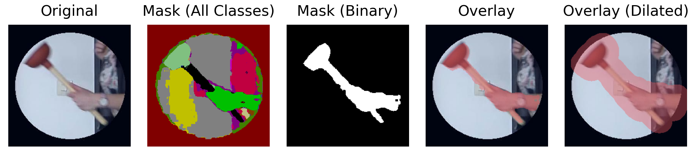

# Using STEGO to Automatically Generate Dynamic Regions of Interest for Eye-Tracking Research

This repository contains the code used to generate the critical-object regions of interest for the following paper:

Körner, H. M., Faul, F., & Nuthmann, A. (in press). Is a knife the same as a plunger? Comparing the attentional effects of weapons and non-threatening unusual objects in dynamic scenes. *Cognitive Research: Principles and Implications*.

The goal of this project is to automatically generate masks that closely fit and follow arbitrary moving objects in dynamic scenes (i.e., videos). The resulting regions of interest can be seen overlaid on the corresponding videos in the [OSF repository](https://osf.io/qk85u) for the Körner et al. (in press) paper.

Using the unsupervised sementic-segmentation framework [STEGO](https://github.com/mhamilton723/STEGO), deep-learning models are trained to generate masks for three different objects, namely a knife, a water bottle, and a plunger. As the input, cropped regions of the videos focusing on the critical objects are provided to the model for each video frame (see the original image in the left panel of the figure below). The approach that worked best was to tell the model to segment many different classes, and to then select the relevant classes afterwards. For the plunger, for example, the suction cup and the handle were grouped into different classes by the model, and the hand of the person holding the plunger was grouped into yet another class. These different classes can then be combined into a binary mask in post-processing, yielding the actual region of interest. In a final step, the binary masks are slightly dilated to account for small inaccuracies in the eye-tracking hardware when mapping eye-movement data to regions of interest. Dilating the masks also corrects minor imperfections in the masks produced by the model.



## Citation

If you use this code in your research, please cite the original paper by [Hamilton et al. (2022)](https://openreview.net/forum?id=SaKO6z6Hl0c) introducing STEGO.

```
@inproceedings{hamilton2022unsupervised,
	title={Unsupervised Semantic Segmentation by Distilling Feature Correspondences},
	author={Mark Hamilton and Zhoutong Zhang and Bharath Hariharan and Noah Snavely and William T. Freeman},
	booktitle={International Conference on Learning Representations},
	year={2022},
	url={https://openreview.net/forum?id=SaKO6z6Hl0c}
}
```

## Usage

The project has been implemented and tested with Python 3.7.9.

### Clone this repository

```bash
git clone https://github.com/HannesMK/ROI-generation-STEGO.git
cd ROI-generation-STEGO
```

### Create and activate a virtual environment (optional)

Windows:

```bash
python -m venv .venv
.venv\Scripts\activate
```

Unix or MacOS:

```bash
python -m venv .venv
source .venv/bin/activate
```

### Install the dependencies

```bash
pip install -r requirements.txt
```

### Reproduce results

To reproduce the demo figure, run [demo_roi.ipynb](src/demo_roi.ipynb).

To create the masks from the trained models, specify the evaluation settings in [eval_config.yml](src/configs/eval_config.yml), and then run [eval_segmentation.py](src/eval_segmentation.py). Afterwards, [post_process_masks.ipynb](src/post_process_masks.ipynb) can be run to create binary masks.

### Bring your own data

For instructions on how to train models on your own data, please see the README of the original [STEGO repository](https://github.com/mhamilton723/STEGO).

Note, however, that due to the rapid development of AI, there may now be more advanced or easier ways to achieve a similar goal. Consider, for example, the recently (as of August 2024) released [Segment Anything Model 2](https://github.com/facebookresearch/segment-anything-2) by Meta.
